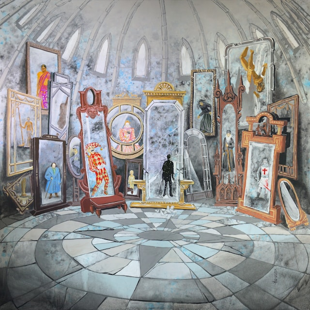
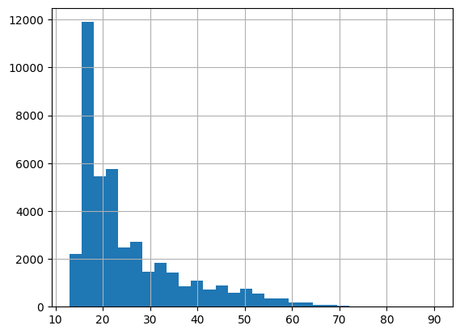
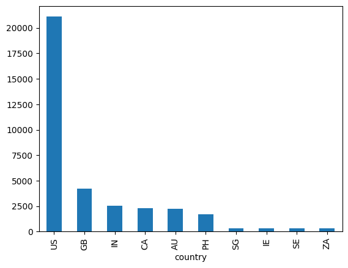
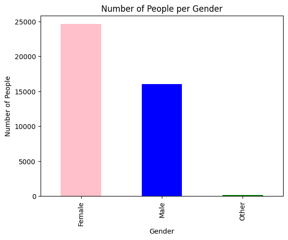
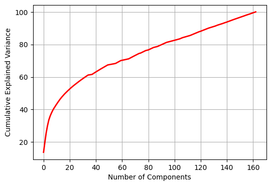
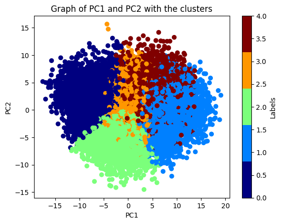
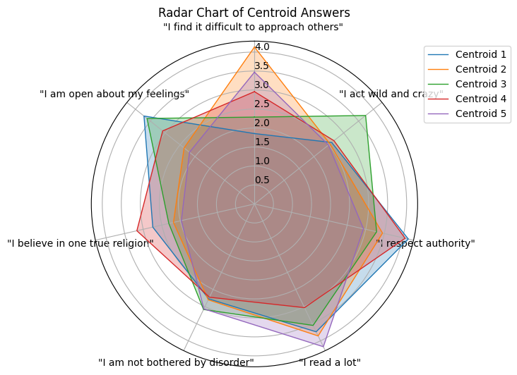
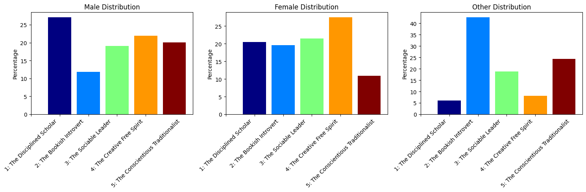
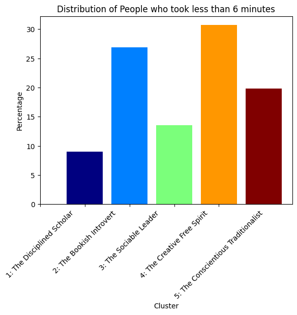

# Unraveling Personalities: A Data-Driven Exploration Using 16PF Questionnaire Responses
**Author:** Luca Barriviera

> Analyzes 16PF personality data (40k+ responses). Uses PCA for question reduction & K-Means clustering to identify 5 personality types. Explores gender distribution.

---

## Table of Contents

-   [Introduction](#introduction)
-   [Dataset](#dataset)
-   [Methodology](#methodology)
    -   [Data Cleaning & EDA](#data-cleaning--eda)
    -   [Principal Component Analysis (PCA)](#principal-component-analysis-pca)
    -   [Clustering (K-Means & GMM)](#clustering-k-means--gmm)
    -   [Personality Classification](#personality-classification)
-   [Key Results](#key-results)
    -   [Principal Components](#principal-components)
    -   [Personality Clusters](#personality-clusters)
    -   [Demographic Insights](#demographic-insights)
-   [Visualizations](#visualizations)
-   [Conclusion](#conclusion)

---

## Introduction

This project explores personality traits using data from the [16PF Questionnaire](https://en.wikipedia.org/wiki/16PF_Questionnaire). The primary goals were:

1.  **Questionnaire Simplification:** To identify a minimal set of questions capable of approximating an individual's personality profile using dimensionality reduction.
2.  **Personality Clustering:** To group participants into distinct personality types based on their responses using clustering techniques.
3.  **Demographic Analysis:** To analyze the distribution of these personality types across different genders and potentially other factors.

The analysis leverages a dataset of over 40,000 participant responses to the 160-statement questionnaire.

---

## Dataset

-   **Source:** [openpsychometrics.org](https://openpsychometrics.org/)
-   **Content:** Responses to 163 statements (160 main 16PF questions + 3 extras) on a 1-5 Likert scale ('Strongly Disagree' to 'Strongly Agree').
-   **Participants:** ~40,000+
-   **Additional Features:** Gender, age, country of origin, self-reported accuracy, time taken (seconds).

---

## Methodology

### Data Cleaning & EDA

-   **Accuracy Filtering:** Removed participants with low self-reported accuracy.
-   **Outlier/Invalid Data Removal:**
    -   Removed participants providing random-like answers (e.g., using only 1 or 2 distinct values, excessive consecutive identical answers).
    -   Filtered out extreme age values.
    -   Removed entries with invalid gender codes (`gender = 0`).
-   **Exploratory Data Analysis (EDA):** Visualized distributions of age, country, and gender to understand the dataset demographics. (See Figures 1-3 in the report).

*(Example EDA Figures from Report)*

### Principal Component Analysis (PCA)

-   **Goal:** Reduce the dimensionality of the 160 question responses.
-   **Process:** Applied PCA to the participant response data.
-   **Component Selection:** Based on the cumulative explained variance (~38%), **7 principal components** were selected. (See Figure 4 in the report for the variance plot).
-   **Interpretation:** Analyzed the statements with the highest loadings (positive or negative) for each component to understand the underlying personality facet it represents.

*(Example PCA Variance Plot from Report)*

### Clustering (K-Means & GMM)

-   **Goal:** Group participants with similar response patterns (personalities).
-   **Methods Compared:**
    -   **K-Means:** Chosen as the primary method due to its tendency to create distinct, non-overlapping clusters suitable for defining personality archetypes. **K=5** clusters were selected.
    -   **Gaussian Mixture Model (GMM):** Explored as an alternative, assuming normally distributed personality traits within clusters. Resulting in more overlapping clusters.
-   **Visualization:** Projected clustered data onto the first two principal components for visualization. (See Figures 5-10 in the report).

*(Example K-Means Plot from Report)*

### Personality Classification

-   **Process:** Analyzed the average responses (centroids) of each K-Means cluster to the key statements identified by PCA.
-   **Tool:** Used a radar chart (Figure 11 in the report) to visualize the centroid profiles across the principal component themes.
-   **Outcome:** Defined 5 distinct personality archetypes based on these profiles.

*(Example Radar Chart from Report)*

---

## Key Results

### Principal Components

The 7 principal components were interpreted as representing facets like:

1.  Social Interactions (Confidence/Ease)
2.  Emotional Expression (Volatility/Liveliness)
3.  Attitude Towards Authority and Rules
4.  Reading Preferences
5.  Tolerance for Disorder
6.  Personal Beliefs and Privacy (e.g., Religion, Self-Disclosure)
7.  Openness and Emotional Expression (Willingness to Share)

### Personality Clusters

Based on K-Means clustering (K=5), the following personality archetypes were identified:

1.  **The Disciplined Scholar:** Organized, values rules, avid reader, may be less emotionally expressive.
2.  **The Bookish Introvert:** Strong affinity for reading, reserved socially, private with emotions.
3.  **The Sociable Leader:** Outgoing, respects authority, values social connections, open emotionally.
4.  **The Creative Free Spirit:** Unconventional, makes friends easily, spontaneous, expressive.
5.  **The Conscientious Traditionalist:** Respects authority/tradition, balanced social tendencies, moderate approach.

### Demographic Insights

Preliminary analysis suggests differences in personality type distribution:

-   **Gender:** Observed variations between male and female participants (e.g., tendency towards 'Bookish Introvert' for women, 'Traditionalist' for men in this sample - see Figures 12, 13).
-   **Response Time:** Fast responders (<6 min) were less likely to be 'Sociable Leaders', while slow responders (>40 min) showed tendencies towards 'Disciplined Scholar' (see Figures 14, 15).

*(Example Distribution Plots from Report)*

---

## Visualizations

This repository contains code to generate visualizations similar to those in the report, including:

-   Histograms for demographic data (Age, Country, Gender)
-   PCA Cumulative Explained Variance plot
-   Scatter plots of clusters projected onto the first two principal components (for K-Means and GMM)
-   Radar chart of cluster centroids
-   Bar charts showing the distribution of personality clusters across different groups (Gender, Response Time)

---

## Conclusion

This project successfully applied PCA and K-Means clustering to a large 16PF dataset. It demonstrated a method for reducing questionnaire length while retaining key personality information and identified five distinct personality clusters. The analysis provides a framework for understanding personality structures and exploring variations across demographic groups, offering valuable insights into human behavior.
